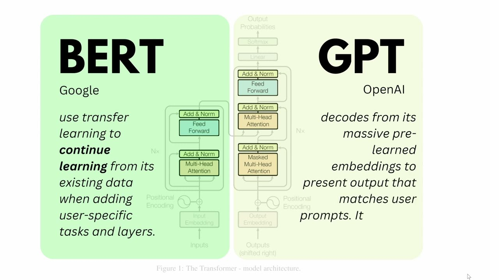
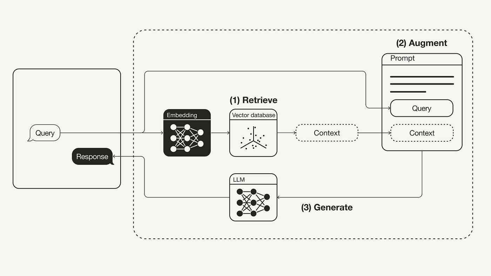
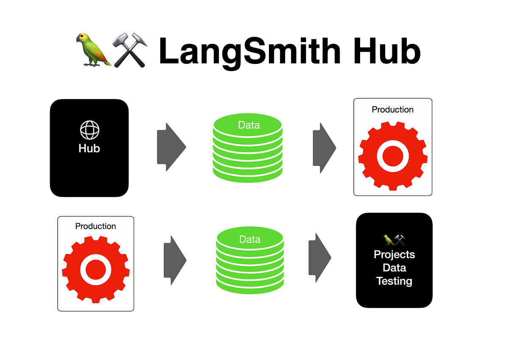
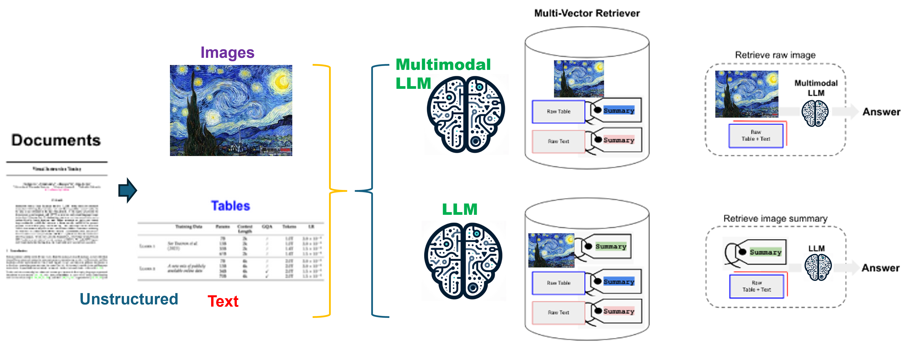
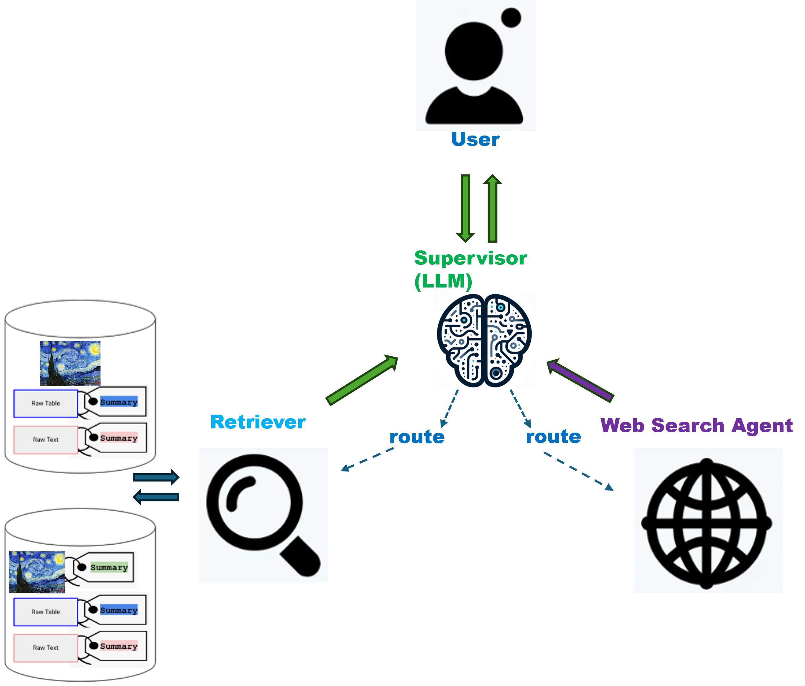
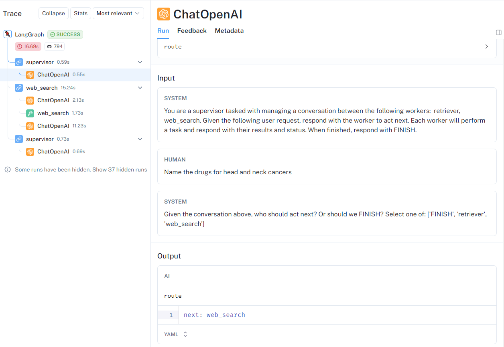

# Multi-modal & multi-agent pdf RAG with LangGraph


## Table of Contents

- [Train and deploy Transformer model using PyTorch on Amazon SageMaker to classify non-coding RNA](#train-and-deploy-transformer-model-using-pytorch-on-amazon-sagemaker-to-classify-non-coding-rna)
  - [Table of Contents](#table-of-contents)
  - [1. Introduction](#1-introduction)
    - [1.1 LLM (Large Language Model)](#11-llm-large-language-model)
    - [1.2 RAG (Retrieval-Augmented Generation)](#12-rag-retrieval-augmented-generation)
    - [1.3 LangChain](#13-langchain)
    - [1.4 LangGraph](#14-langgraph)
    - [1.5 LangSmith](#15-langsmith)
    - [1.6 Unstructed](#16-unstructed)
  - [2. MultiModal PDF](#2-multimodal-pdf)
  - [3. Semi-structured and Multi-modal RAG](#3-semi-structured-and-multi-modal-rag)
  - [4. LangGraph to add multi-agent](#4-langgraph-to-add-multi-agent)
    - [4.1. Archetecture of the LangGraph multi-agent RAG](#41-archetecture-of-the-langgraph-multi-agent-rag)
    - [4.2. LangSmith presentation](#42-langsmith-presentation)
    - [4.3. The code](#43-the-code)
  - [5. Deployment](#5-deployment)
  - [Contact](#contact)

The paper ‘Attention Is All You Need’ describes transformers and what is called a sequence-to-sequence architecture. Sequence-to-Sequence (or Seq2Seq) is a neural net that transforms a given sequence of elements, such as the sequence of words in a sentence, into another sequence. The [Transformer](https://en.wikipedia.org/wiki/Transformer_(machine_learning_model)) architecture follows an encoder-decoder structure, but does not rely on recurrence and convolutions in order to generate an output. Here, we hypothesis that we can predict if DNA/RNA fragments have the potential to form circRNAs solely by the sequence. We believe that by feeding the transformer model enough circRNAs and lincRNAs sequences, the model can learn to distinguish these two class by the DNA/RNA sequences. And the size of these Transformer models are often too large to train on local computers, cloud computing platforms (e.g. [GCP](https://cloud.google.com/), [AWS](https://aws.amazon.com/), [Azure](https://azure.microsoft.com/)) are commonly used. Here, I would like to demonstrate how to train and deploy a transformer model from scratch for circRNA classification using Amazon SageMaker, streamlit and docker.

## 1. Introduction

### 1.1 LLM (Large Language Model)

Large Language Models (LLMs) are advanced artificial intelligence systems trained on vast amounts of text data. They can understand, generate, and interpret human language with remarkable accuracy. Most Large Language Models are based on Transformers, which are a type of neural network architecture that rely on self-attention mechanisms to process sequential data. BERT (Bidirectional Encoder Representations from Transformers) focuses on understanding the context of words by looking at them from both sides within a text, improving tasks like question answering and language inference, while GPT (Generative Pre-trained Transformer) excels in generating coherent and contextually relevant text based on a given prompt, by predicting the next word in a sequence. Their versatility and efficiency make them invaluable tools for various applications, including chatbots, content creation, and information retrieval, revolutionizing how we interact with technology.

<p align="center">

<br>
<em>BERT and GPT: The Encoder-Decoder Structure of the Transformer Architecture</em></p>


### 1.2 RAG (Retrieval-Augmented Generation)

Retrieval-Augmented Generation (RAG) combines the best of both worlds from retrieval-based and generative approaches in natural language processing. It leverages a powerful language model for generating responses and an external knowledge source (like a database or the internet) from which it retrieves information to inform those responses. Essentially, RAG first searches for relevant information related to a query, then uses this context to generate accurate, informative answers. This approach allows RAG to provide more detailed and specific responses than traditional models, making it particularly useful for tasks requiring deep knowledge or factual accuracy, such as question answering and content creation.

<p align="center">

<br>
<em>RAG (Retrieval-Augmented Generation)</em></p>

### 1.3 LangChain

LangChain is a blockchain platform designed to facilitate multilingual communication and content sharing. It aims to overcome language barriers by providing a decentralized network for translation services, language learning, and cross-cultural communication. Through the use of smart contracts and a native cryptocurrency, LangChain incentivizes users to contribute to the platform and rewards them for their linguistic expertise. By leveraging blockchain technology, LangChain seeks to create a global community where language differences are no longer a hindrance to collaboration and understanding.


### 1.4 LangGraph

LangGraph is a library built on top of LangChain, designed for creating stateful, multi-agent applications with LLMs (large language models). It enables the construction of cyclical graphs, often needed for agent runtimes, and extends the LangChain Expression Language to coordinate multiple chains or actors across multiple steps. LangGraph's main use is for adding cycles to LLM applications, and it provides features such as built-in persistence, async workflows, and the ability to save and resume the state of the graph. It is intended to be used with LangChain and offers a way to create state machines by specifying them as graphs.


### 1.5 LangSmith

LangSmith is a paid LLMOps product offered by LangChain, a startup that supports the development of large language model (LLM) applications. It is designed as an all-in-one platform to accelerate LLM application workflows, covering the entire project lifecycle from development and testing to deployment and monitoring. LangSmith, which has seen significant early adoption, provides visibility into LLM applications, deployment with hosted LangServe, and comprehensive monitoring capabilities. It is used by thousands of enterprises, including well-known companies such as Rakuten, Elastic, Moody’s, and Retool.

<p align="center">

<br>
<em>LangSmith</em></p>

### 1.6 Unstructed

Unstructed is a comprehensive platform that offers a wide range of tools and services for unstructured data management and analysis. It is designed to help organizations extract valuable insights from unstructured data sources such as text, images, and videos. Unstructed provides capabilities for data ingestion, preprocessing, natural language processing, machine learning, and visualization, enabling users to derive meaningful information from diverse and complex data sets. The platform's flexibility and scalability make it suitable for various industries, including finance, healthcare, e-commerce, and more. Unstructed empowers businesses to make data-driven decisions and unlock the full potential of their unstructured data assets..


## 2. MultiModal PDF

PDF, standing for Portable Document Format, has become one of the most widely used document formats. PDF can contain multi modal data, including text, table, images. RAG with the text in pdf using LLM is very common right now, but with table especially with images are still challenging right now.


## 3. Semi-structured and Multi-modal RAG

Multimodal Large Language Models (LLMs) are designed to process and generate information across different modes of data, such as text, images, and sometimes audio or video. These models have the ability to understand and generate content that combines these different forms of data, enabling more comprehensive AI applications.

With the emergence of multimodal LLMs (such as GPT4-V, LLaVA, or FUYU-8b), it is possible to utilize images in RAG:

Utilize a multimodal Large Language Model (like GPT4-V with Vision, LLaVA, or FUYU-8b) to create summaries from visual content. Embed the extracted text for storage and quick retrieval. Then, feed segments of this text into an LLM to generate sresponses.

This rephrased version maintains the original instructions' intent while presenting the process in a slightly different structure and wording.
<p align="center">

<br>
<em>Semi-structured and Multi-modal RAG</em></p>

## 4. LangGraph to add multi-agent

### 4.1. Archetecture of the LangGraph multi-agent RAG

When we build the RAG system, the system can only answer questions that related to the documents in the vector database. By leveraging the LangGraph multi-agent, we can add a web search agent to the system, and use an LLM to orchestrate the different agents. LLM acts as "Supervisor", interacts with the user, and detemine the next setp, "Retriever", "Web search" or "End".

<p align="center">

<br>
<em>LangGraph Flow Chart</em></p>

### 4.2. LangSmith presentation

We can check the whole process of the pipeline, how supervisor makes decision and interacts with agents.

<p align="center">

<br>
<em>LangGraph Flow Chart</em></p>

### 4.3. The code

Here shows the code of how to construct the LangGraph

```python
prompt = ChatPromptTemplate.from_messages(
    [
        ("system", system_prompt),
        MessagesPlaceholder(variable_name="messages"),
        (
            "system",
            "Given the conversation above, who should act next?"
            " Or should we FINISH? Select one of: {options}",
        ),
    ]
).partial(options=str(options), members=", ".join(members))

llm = ChatOpenAI(model="gpt-4-1106-preview")

supervisor_chain = (
    prompt
    | llm.bind_functions(functions=[function_def], function_call="route")
    | JsonOutputFunctionsParser()
)


#Construct Graph
retriever_agent = create_agent(llm, retriever_tools, "You are a retriever tools.")
retriever_node = functools.partial(agent_node, agent=retriever_agent, name="retriever")

search_engine_agent = create_agent(llm, [web_search], "You are a web search engine.")
search_engine_node = functools.partial(agent_node, agent=search_engine_agent, name="web_search")


workflow = StateGraph(AgentState)
workflow.add_node("retriever", retriever_node)
workflow.add_node("web_search", search_engine_node)
workflow.add_node("supervisor", supervisor_chain)

for member in members:
    # We want our workers to ALWAYS "report back" to the supervisor when done
    workflow.add_edge(member, "supervisor")
# The supervisor populates the "next" field in the graph state
# which routes to a node or finishes
conditional_map = {k: k for k in members}
conditional_map["FINISH"] = END
workflow.add_conditional_edges("supervisor", lambda x: x["next"], conditional_map)
# Finally, add entrypoint
workflow.set_entry_point("supervisor")

graph = workflow.compile()  
```

## 5. Deployment
Here is an online [demo](http://18.226.34.69:8502/) of this multi-agent RAG system.


## Contact

- **Author**: Wei Zhang
- **Email**: [zwmc@hotmail.com](zwmc@hotmail.com)
- **Github**: [https://github.com/vveizhang](https://github.com/vveizhang)
- **Linkedin**: [https://www.linkedin.com/in/wei-zhang-76253523/](https://www.linkedin.com/in/wei-zhang-76253523/)
